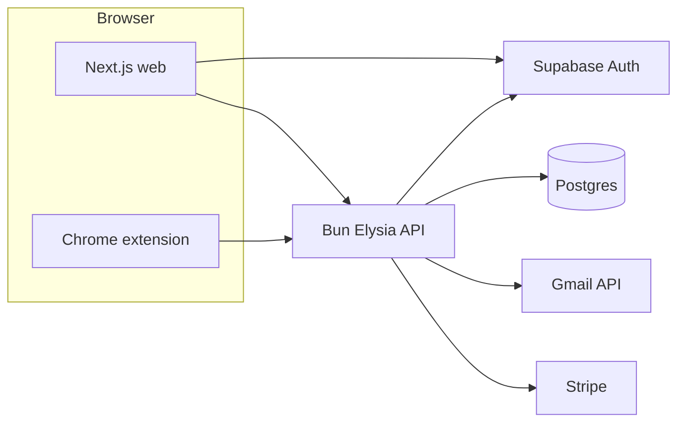

# MailPilot

AI-assisted email workflows: a **Next.js** dashboard with **Supabase Auth**, a **Bun / Elysia** API, and a **Plasmo** Chrome extension. Gmail is connected via Google OAuth on the backend.

## Overview

| Package | Role |
| ------- | ---- |
| [`apps/web`](apps/web) | Next.js 16 app: sign-in, settings, Gmail connect completion (`/connect/gmail/done`), calls the API with `NEXT_PUBLIC_API_URL` and the user’s Supabase session. |
| [`apps/backend`](apps/backend) | Elysia HTTP API: auth helpers, user sync and extension linking, Gmail OAuth, chat, usage, Stripe billing. |
| [`apps/extention`](apps/extention) | Chrome extension (popup, side panel): talks to the API via `PLASMO_PUBLIC_API_URL` (default `http://localhost:3000`). |
| [`packages/db`](packages/db) | Shared **Drizzle** schema and Postgres access used by the backend. |

> [!TIP]
> Full route lists and auth rules live in **[docs/API.md](docs/API.md)**. With the API running, open **[http://localhost:3000/swagger](http://localhost:3000/swagger)** for interactive OpenAPI (JSON at `/swagger/json`).

## Architecture



- **Web** uses Supabase for sessions; protected API calls send `Authorization: Bearer <access_token>`.
- **Extension** bootstraps an anonymous user (`POST /user/bootstrap-extension`) and can be **linked** to the web account with a one-time code from Settings (`POST /user/link-code` → `POST /user/link-extension`).
- **Gmail** OAuth starts at `GET /oauth/google/start?userId=…` (browser redirect); after success, Google redirects to the callback and the API forwards to **`OAUTH_SUCCESS_URL`** (e.g. your web origin + `/connect/gmail/done?connected=1`).

## Getting started (local)

> [!NOTE]
> Requires [Bun](https://bun.sh/), Postgres, and a recent Chrome build. Copy env examples before running services.

1. **Install dependencies** (repo root)

   ```bash
   bun install
   ```

2. **Database** — set `DATABASE_URL` for [`packages/db`](packages/db) (see [`apps/backend/.env.example`](apps/backend/.env.example)), then apply migrations:

   ```bash
   cd packages/db
   bun run drizzle:migrate
   ```

3. **Environment files**

   - Backend: copy [`apps/backend/.env.example`](apps/backend/.env.example) to `apps/backend/.env` or `.env.local` and fill values (Supabase service role, Google OAuth, Stripe, etc.).
   - Web: copy [`apps/web/.env.example`](apps/web/.env.example) — `NEXT_PUBLIC_SUPABASE_*`, `NEXT_PUBLIC_API_URL` (point at `http://localhost:3000`).
   - Extension: set `PLASMO_PUBLIC_API_URL` when building (e.g. in `.env` next to the Plasmo app) if not using the default.

4. **Run the API** (port **3000**)

   ```bash
   cd apps/backend
   bun run dev
   ```

5. **Run the web app** on another port to avoid clashing with the API, e.g. **3001**:

   ```bash
   cd apps/web
   bun run dev -- -p 3001
   ```

6. **Run the extension**

   ```bash
   cd apps/extention
   bun run dev
   ```

   In Chrome: `chrome://extensions` → Developer mode → **Load unpacked** → choose the Plasmo dev output (e.g. `apps/extention/build/chrome-mv3-dev`).

Align **`OAUTH_SUCCESS_URL`** on the backend with your web origin and Gmail done page, for example `http://localhost:3001/connect/gmail/done`, so the OAuth callback can redirect users back to the dashboard.

## Docker

Only the **backend** is containerized ([`apps/backend/Dockerfile`](apps/backend/Dockerfile), [`docker-compose.yml`](docker-compose.yml)).

```bash
docker compose up --build backend
```

The compose file expects secrets in **`apps/backend/.env.local`**. The web app and extension still run locally with the steps above.

## Project structure

- `apps/backend` — Elysia API; see [docs/API.md](docs/API.md) and `/swagger`.
- `apps/web` — Next.js 16 dashboard and Supabase SSR.
- `apps/extention` — Plasmo + React (popup, side panel, options).
- `packages/db` — Drizzle schema and migrations.
- `packages/eslint-config`, `packages/typescript-config` — shared tooling.

## Tech stack

- **API:** Bun, Elysia, Drizzle, Google APIs, Stripe, OpenAI Agents.
- **Web:** Next.js 16, React 19, Supabase JS/SSR, Tailwind CSS v4.
- **Extension:** Plasmo, React 18, Tailwind v3, TanStack Query.
- **Monorepo:** Turborepo, TypeScript, ESLint, Prettier.
