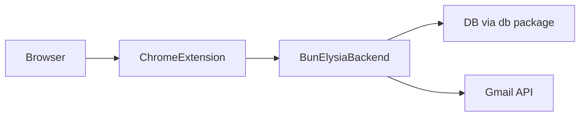

# MailPilot

AI-powered email drafting and Gmail assistance, delivered as a Chrome extension backed by a Bun/Elysia API.

MailPilot helps you read context, draft responses, and send emails faster, with a lightweight backend and a focused extension UI.

## Overview

MailPilot is a monorepo that contains:

- A **backend API** (`apps/backend`) built with [Bun](https://bun.sh/) and [Elysia](https://elysiajs.com/) that:
  - Stores user conversations in a database via the `db` package.
  - Integrates with Gmail via OAuth to read and send email on behalf of the user.
  - Uses OpenAI Agents to generate and refine email drafts.
- A **Chrome extension** (`apps/extention`) built with [Plasmo](https://docs.plasmo.com/) and React that:
  - Renders a polished popup and sidepanel UI using Tailwind v3 and CSS variables.
  - Connects to the backend to orchestrate AI-assisted email flows.

## Architecture



- The **extension** runs entirely in the browser and talks to the backend over HTTP.
- The **backend** exposes routes for authentication, chat, and Gmail OAuth, and persists data using the shared `db` package.

## Getting Started (local)

> [!NOTE]
> These commands assume you have [Bun](https://bun.sh/) installed and a recent Node/Chrome setup.

1. **Install dependencies**

   ```bash
   bun install
   ```

2. **Run the backend**

   ```bash
   cd apps/backend
   bun run dev
   # Backend listens on http://localhost:3000
   ```

3. **Run the extension**

   ```bash
   cd apps/extention
   bun run dev
   ```

   Then in Chrome:

   - Open `chrome://extensions`.
   - Enable **Developer mode**.
   - Click **Load unpacked** and choose the dev build directory documented by Plasmo (e.g. `apps/extention/build/chrome-mv3-dev`).

You can now open the popup or sidepanel surfaces and interact with MailPilot while the backend is running on `localhost:3000`.

## Running with Docker

Only the **backend API** is containerized. The Chrome extension is still built with Plasmo and loaded into Chrome via `chrome://extensions`.

This repository includes a Docker setup (see `apps/backend/Dockerfile` and `docker-compose.yml`):

- `docker compose up --build backend` will:
  - Build a multi-stage image for the Bun/Elysia API.
  - Start the backend on `http://localhost:3000`.

Use Docker to run the backend in a reproducible environment and integrate with CI/CD. The extension continues to be developed and loaded using the normal Plasmo workflow.

## Project Structure

- `apps/backend` – Bun/Elysia API for chat, users, auth, and Gmail OAuth.
- `apps/extention` – Plasmo-based React extension (popup, sidepanel, options, newtab).
- `packages/db` – Drizzle ORM schema and database access shared by the backend.
- `packages/eslint-config`, `packages/typescript-config` – Shared tooling configuration.

## Tech Stack and Conventions

- **Backend**: Bun, Elysia, Drizzle ORM, OpenAI Agents.
- **Extension**: Plasmo, React 18, Tailwind CSS v3, CSS variables for theming.
- **Monorepo tooling**: Turborepo, TypeScript, ESLint, Prettier.
- **Styling**:
  - Tailwind v3 with `@tailwind base/components/utilities` in `apps/extention/src/style.css`.
  - Design tokens (colors, radii, typography) defined as CSS variables.
  - Micro-interactions implemented via Tailwind utilities and CSS transitions (no Motion/Framer Motion dependency).

For more details on the extension’s styling and motion principles, see the Tailwind v3 styling plan (`.cursor/plans/retune_extension_to_tailwind_v3_b6491fc0.plan.md`) used during development.
